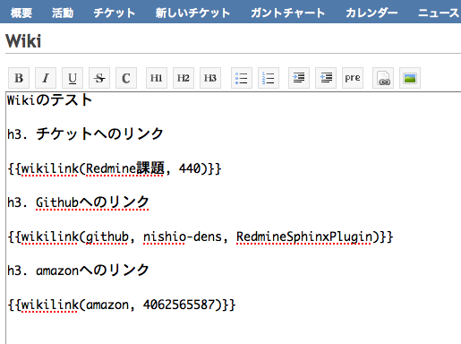
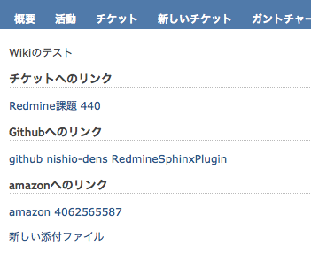

.. Wikilink Converter documentation master file, created by
   sphinx-quickstart on Fri Aug  5 17:10:39 2011.
   You can adapt this file completely to your liking, but it should at least
   contain the root `toctree` directive.

Wikilink Converter's documentation!
==============================================

本ツールは、Redmine上のwikiで任意のURLを簡単に生成できるプラグインです。

例えば、図1のように記述したコマンドを、図2のようなURLに簡単に変換できます。

図1: Wikiの編集画面

図2. Wikiの出力画面

目次
--------------

.. toctree::

  introduction

